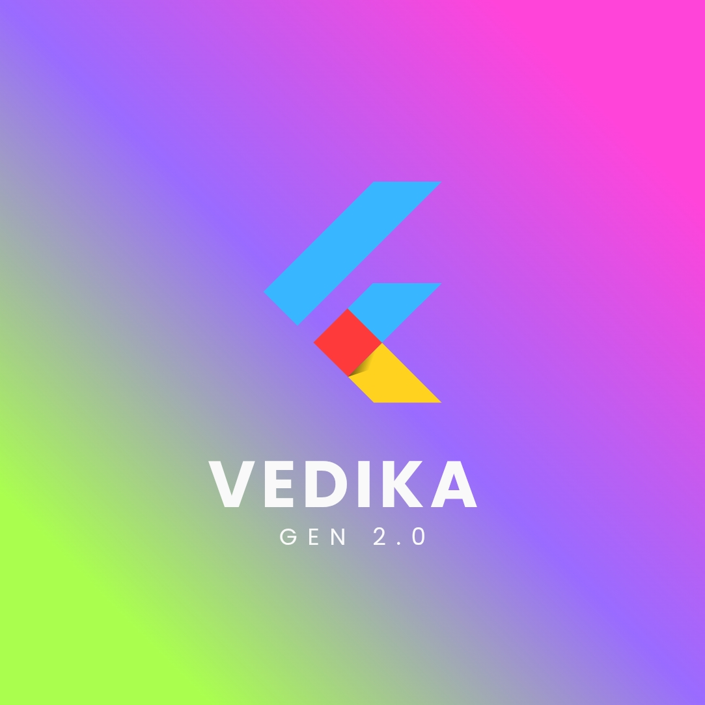

<p align="center">
  
</p>

# ✨ Vedika 4.1 Flash

### 🚀 Next-Generation AI by Veda Labs

> **1M Token Context** | **Ultra-Low Latency** | **Built for Long-Horizon Coding** | **100% Free**

---

## 🌟 Introduction

Welcome to **Vedika 4.1 Flash**, a cutting-edge large language model developed by **Veda Labs** under the leadership of **Divy Patel**. Engineered for developers, researchers, and AI enthusiasts, Vedika represents a new paradigm in accessible, high-performance AI.

---

## 🔥 Breakthrough Capabilities

### 💻 Built for Long-Horizon Coding
Vedika is optimized for complex software development workflows:
- **Multi-file code generation** with coherent architecture across entire projects
- **Full-stack application design** from database schemas to frontend components
- **Advanced multi-script debugging** with contextual understanding of interdependent modules

### 📚 1 Million (1M) Token Context Window
Unprecedented context capacity enables:
- Ingestion of **massive datasets** in a single pass
- Analysis of **entire code repositories** without chunking
- Complete **API documentation** comprehension simultaneously
- Long-form document processing and cross-referencing

### ⚡ Ultra-Low Latency
Engineered for real-time performance:
- **Blazing-fast inference** optimized for production environments
- Perfect for **real-time AI agents** and interactive applications
- Sub-second response times for optimal user experience

### 🆓 100% Free Access
Committed to the developer community:
- **Completely free** with no paywalls or usage limits
- Open access for research, commercial, and educational purposes
- No hidden costs or premium tiers

---

## 🚀 Quick Start / API Access

Get started with Vedika 4.1 Flash using our simple REST API:

### cURL Example

```bash
curl -X POST "https://vedalabs-vedika-advanced-ai-4-1-flash.hf.space/v1/chat/completions" \
  -H "Content-Type: application/json" \
  -d '{
    "model": "vedika-4.1-flash",
    "messages": [
      {
        "role": "user",
        "content": "Explain quantum computing in simple terms."
      }
    ],
    "temperature": 0.7,
    "max_tokens": 512
  }'
```

### Python Example

```python
import requests

url = "https://vedalabs-vedika-advanced-ai-4-1-flash.hf.space/v1/chat/completions"

payload = {
    "model": "vedika-4.1-flash",
    "messages": [
        {"role": "user", "content": "Write a Python function to sort a list."}
    ],
    "temperature": 0.7,
    "max_tokens": 512
}

response = requests.post(url, json=payload)
print(response.json()["choices"][0]["message"]["content"])
```

---

## 📋 Technical Specifications

| Specification | Details |
| :------------ | :------ |
| **Model Name** | Vedika 4.1 Flash |
| **Developer** | Divy Patel |
| **Organization** | Veda Labs |
| **Context Window** | 1,000,000 tokens |
| **Architecture** | Transformer with Flash Attention |
| **Optimization** | Long-horizon coding, multi-file generation |
| **Latency** | Ultra-low, real-time optimized |
| **License** | Apache 2.0 |
| **Access** | 100% Free |

---

## 🎯 Use Cases

- **Software Development**: Generate, debug, and refactor code across multiple files
- **Documentation Analysis**: Process entire API docs and technical manuals
- **Research**: Analyze large corpora and cross-reference academic papers
- **AI Agents**: Power real-time conversational and task-oriented agents
- **Education**: Free access for students and educators worldwide

---

## ⚠️ Limitations

- **Beta Release**: As a newly developed model, edge cases may exist
- **Specialized Focus**: Optimized for coding and long-context tasks; general knowledge may vary
- **API Dependency**: Requires internet connectivity for cloud-based inference

---

**✨ A Product of Veda Labs**
